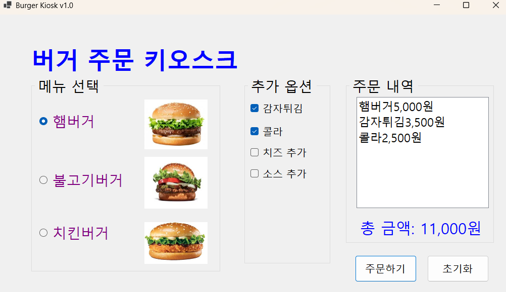
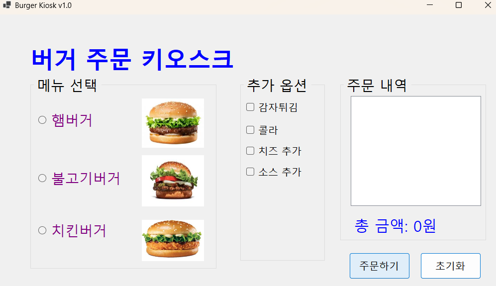
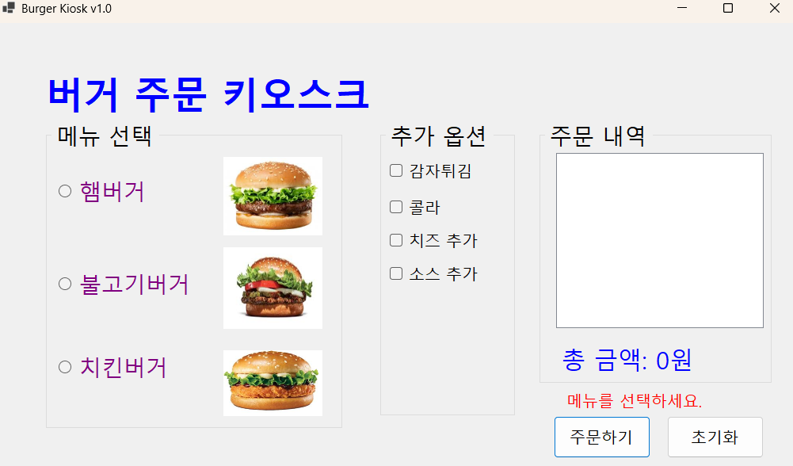
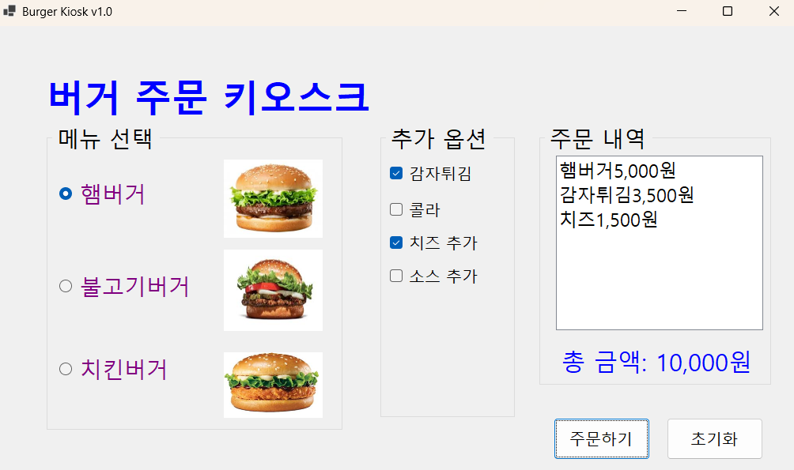

# (C# 코딩) 버거 주문 키오스크

## 개요  
-C# 프로그래밍학습   
-1줄소개:햄버거를 주문하는 키오스크
-사용한플랫폼: -C#, .NET Windows Forms, Visual Studio, GitHub  
-사용한컨트롤:CheckBox, RadioButton, Label, Button, GroupBox  
-구현한기능  
메뉴선택기능: RadioButton을활용한단일메뉴선택  
옵션선택기능: CheckBox를활용한복수선택처리  
가격계산기능: 선택된항목들의가격을합산  
이벤트처리: 버튼클릭시전체로직실행  
조건문활용: 선택여부에따른분기처리  
UI 업데이트: 사용자입력에따라화면즉시반영

## 실행화면(과제1)
-과제1코드의실행스크린샷

-과제내용  
기본적인 ui 만들기  
메뉴 선택에 따른 가격 계산 및 주문가능    
초기화 버튼을 통해 주문내역 초기화가능  

-구현내용과기능설명  
라디오버튼과 체크박스의 .Checked 속성이 true인지 검사하여 각각 지정된 가격(예: 5,000원, 3,500원 등) 추가  
선택된 항목의 이름과 가격을 lstOrder.Items.Add("항목 이름 가격") 코드를 통해 리스트박스에 한 줄씩 추가  
'초기화' 버튼 클릭 시 모든 선택 항목(Checked = false)을 해제하고, 리스트박스와 금액 레이블을 처음 상태로 되돌림  

## 실행화면(과제2)
-과제2코드의실행스크린샷

-과제내용
아무것도 선택하지않았을 경우 메뉴를 선택하세요 메세지가 뜨게함

-구현내용과기능설명
label을 if문을 통해 체크되었을 시 visible이 false로 되고  
체크가 안되었을 시 true로 되어 메세지를 표시함  

## 실행화면(과제3)
-과제3코드의실행스크린샷

-과제내용
Tab을 이용해서 GroupBox 사이를 이동하기  
방향키를 이용해서 선택 아이템 사이를 이동하기  
스페이스바를 이용해서 아이템 선택하기  
Enter키로 버튼을 누르기  
-구현내용과기능설명  
AcceptButton 속성을 활용해 마우스 사용을 최소화하고 Enter 키만으로 주문이 가능하게 구현  
tap의 순서를 지정해서 tap을 통해서 메뉴를 선택  

## 실행화면(과제4)

-과제4코드의실행스크린샷

-과제내용
 

-구현내용과기능설명
   